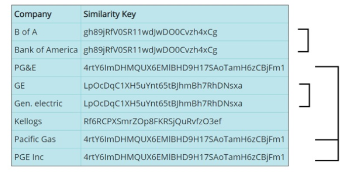
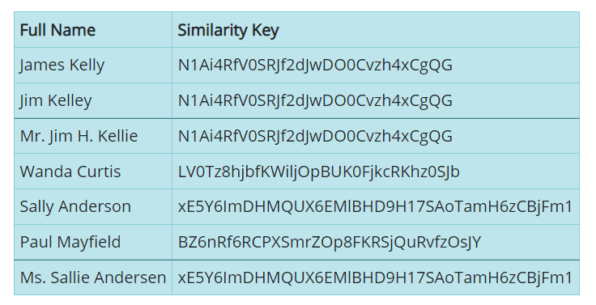
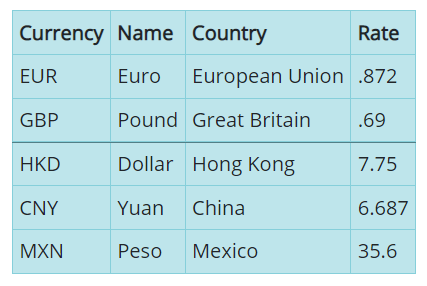
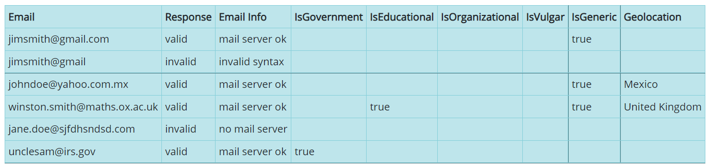
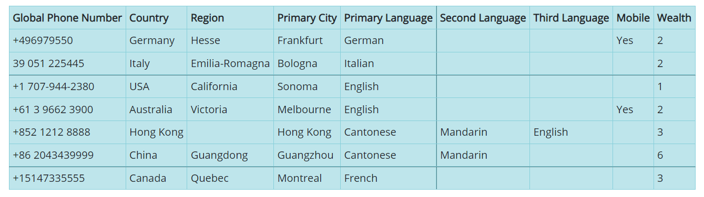
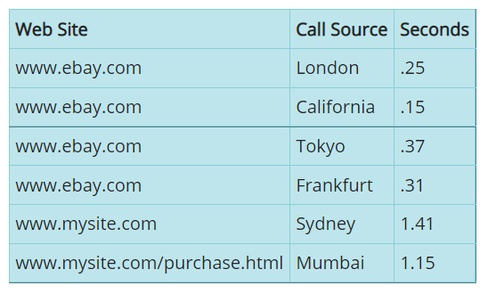
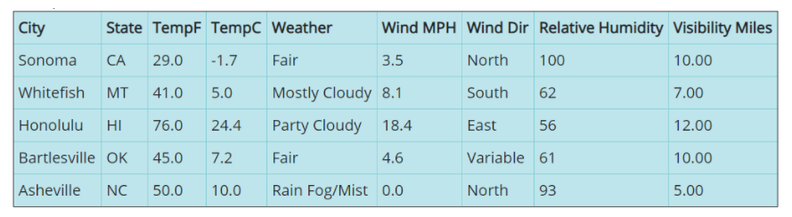

# Python-Examples

These are code examples showing how to call and utilize Interzoid's various Cloud APIs using Python. Interzoid's APIs provide real-time data in several categories for integration into Web sites, applications, and business processes. There are also data matching and data validation APIs that can significantly improve the value of your data assets.

**GetCompanyMatchSimkey.py** - generates a similarity key to use to match/locate other similar company names ("IBM" & "International Business Machines", etc.) - visit the API Page: https://www.interzoid.com/services/getcompanymatchadvanced  
  

**GetFullNameMatchSimkey.py** - generates a similarity key to use to match/locate other similar individual names ("Thomas Johnson" & "Mr. Tom Johntsen", etc.) - visit the API Page: https://www.interzoid.com/services/getfullnamematch 

**GetCurrencyRate.py** - Retrieves a real-time currency rate for 150+ global currencies - visit the API Page: https://www.interzoid.com/services/getcurrencyrate 

**GetEmailInformation.py** - Retrieves email validity and several other data points for a given email address - visit the API Page: https://www.interzoid.com/services/getemailinfo 

**GetGlobalNumberInformation.py** - Retrieves geographic information, mobile, language and other demographics for a global telephone number - visit the API Page: https://www.interzoid.com/services/getglobalnumberinfo

**GetPagePerformance.py** - Measures page load times or API call performance from 20+ global locations - visit the API Page: https://www.interzoid.com/services/globalpageload 

**GetWeatherFromZip.py** - Retrieves temperature and other information about current weather conditions for a zip code - visit the API Page: https://www.interzoid.com/services/getweatherzip

To register for your free **API Key** (a block of free API credits), visit here: https://www.interzoid.com/register  
  
  
These APIs can also be called in batch mode retrieving input data and writing results from/to databases such as Postgres, MySQL, MariaDB, Snowflake, AWS Aurora, SQL Server, Access, .CSV files, etc. (native/odbc & local or Cloud). For more info visit here: https://www.interzoid.com/connect

contact support@interzoid.com with any questions or feedback
